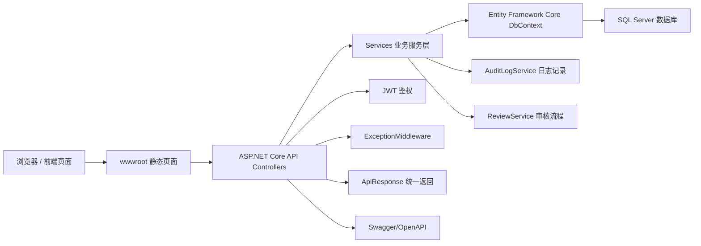
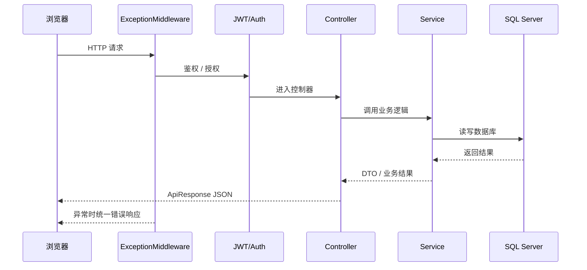
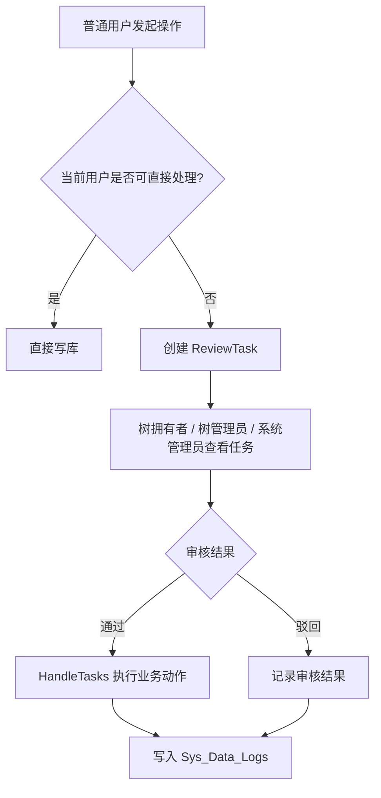
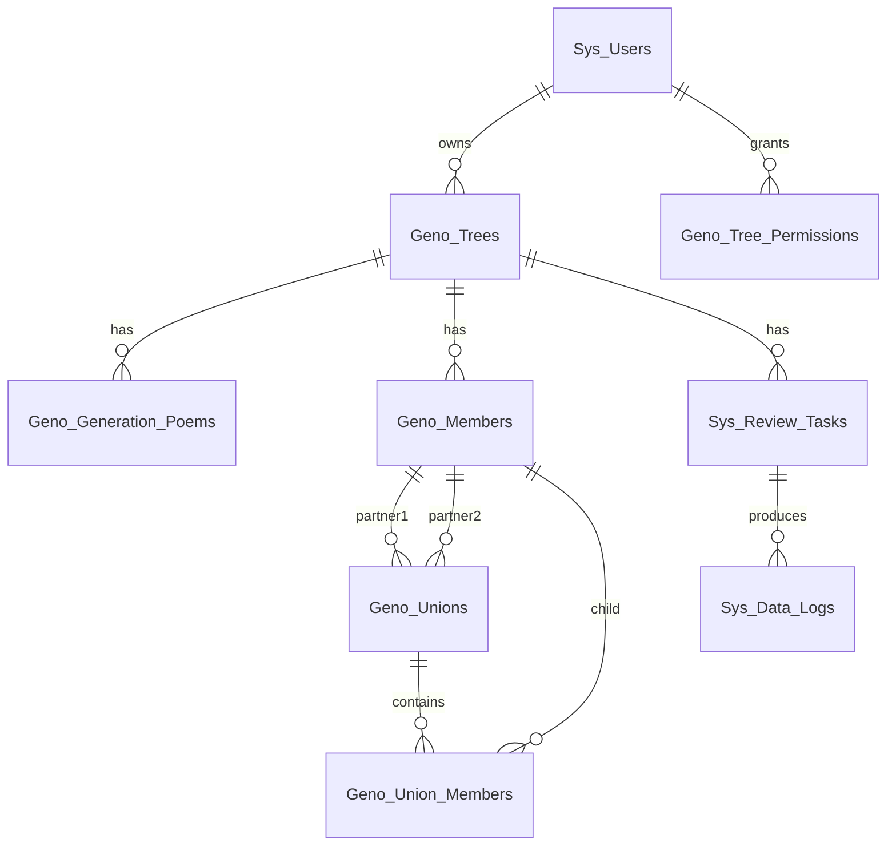

# 完全由AI构建的简朴管理系统WEB API

## 1. 系统概述

本项目是一个基于 `ASP.NET Core 8 + Entity Framework Core + SQL Server + 原生 HTML/CSS/JavaScript` 的家谱管理系统。  
系统围绕“用户账户、家谱树、字辈、树成员、树权限、审核流程、婚姻单元图、数据库日志”这些核心能力展开，既支持公开谱录浏览，也支持登录后的修谱、审核与授权协作。

从工程结构上看，整个解决方案目前是一个单体 Web 应用：

- 后端 API、鉴权、中间件、数据库访问集中在同一个 ASP.NET Core 项目中
- 前端页面放在 `wwwroot` 下，以静态页面方式直接由应用提供
- 前后端通过 JSON API 交互，返回格式统一为 `{ code, message, data }`
- 系统启动时自动检查并补齐部分数据库表结构

## 2. 技术栈

### 2.1 后端技术

- `ASP.NET Core 8`
- `Entity Framework Core`
- `SQL Server`
- `JWT Bearer Authentication`
- `Serilog`
- `Swagger / OpenAPI`

### 2.2 前端技术

- 原生 `HTML`
- 原生 `CSS`
- 原生 `JavaScript`
- 浏览器端使用 `fetch` 调用后端接口
- 通过 `localStorage` 存储登录 Token

## 3. 解决方案结构

当前解决方案只有一个主项目：

```text
Geno.sln
└── 家谱
    ├── Controllers
    ├── Services
    ├── Models
    │   ├── DTOs
    │   ├── Entities
    │   └── Enums
    ├── DB
    ├── Middleware
    ├── Common
    ├── Setting
    └── wwwroot
```

各目录职责如下：

- `Controllers`
  - 提供 HTTP API 入口
  - 负责参数接收、权限初判、统一返回 `ApiResponse.OK(...)`
- `Services`
  - 承载主要业务逻辑
  - 包括认证、家谱树、字辈、成员、树权限、审核、婚姻单元图、日志等服务
- `Models/Entities`
  - 数据库实体定义
- `Models/DTOs`
  - 接口输入输出模型
- `Models/Enums`
  - 审核动作、角色、状态等枚举与显示文案
- `DB`
  - `GenealogyDbContext`
- `Middleware`
  - 全局异常处理中间件
- `wwwroot`
  - 前端静态页面

## 4. 总体架构



这套结构的特点是：

- 前端部署简单，随应用一起发布
- 后端服务职责清晰，控制器与业务逻辑分层
- 审核流、权限流、日志流统一收口到服务层
- 适合当前中小型项目快速演进

## 5. 启动入口与中间件

应用入口在 [Program.cs](/E:/Visual%20Studio/Projections/Geno/%E5%AE%B6%E8%B0%B1/Program.cs)。

系统启动时主要完成了这些事情：

1. 配置 `ContentRootPath` 和 `WebRootPath`
2. 注入 `DbContext`
3. 注册业务服务
4. 配置 JWT 鉴权
5. 配置 Swagger
6. 配置 CORS
7. 配置统一模型校验失败返回
8. 执行数据库结构补齐
9. 启用异常中间件、静态文件、中间件管道和控制器映射

请求处理顺序大致如下：



## 6. 核心后端模块

### 6.1 账户与身份认证

相关控制器和服务：

- [AccountController.cs](/E:/Visual%20Studio/Projections/Geno/%E5%AE%B6%E8%B0%B1/Controllers/AccountController.cs)
- [AuthService.cs](/E:/Visual%20Studio/Projections/Geno/%E5%AE%B6%E8%B0%B1/Services/AuthService.cs)

主要能力：

- 用户注册
- 用户登录
- 获取个人资料
- 修改资料
- 找回密码
- 搜索系统用户

实现特点：

- 使用 `BCrypt` 存储密码哈希
- 登录成功后签发 JWT
- Token 中包含用户 ID、用户名、角色等 Claim
- 前端用 `Authorization: Bearer <token>` 访问受保护接口

### 6.2 家谱树管理

相关模块：

- [GenoTreeController.cs](/E:/Visual%20Studio/Projections/Geno/%E5%AE%B6%E8%B0%B1/Controllers/GenoTreeController.cs)
- [GenoTreeService.cs](/E:/Visual%20Studio/Projections/Geno/%E5%AE%B6%E8%B0%B1/Services/GenoTreeService.cs)

主要能力：

- 创建家谱树
- 修改家谱树
- 删除家谱树
- 获取可访问树列表
- 获取单棵树详情

实现特点：

- 树支持公开 / 私有
- 树详情会聚合 `Poems`、`Unions`、`Access`、`Permissions`
- 普通用户部分操作会进入审核流

### 6.3 字辈管理

相关模块：

- [PoemController.cs](/E:/Visual%20Studio/Projections/Geno/%E5%AE%B6%E8%B0%B1/Controllers/PoemController.cs)
- [GenoPoemService.cs](/E:/Visual%20Studio/Projections/Geno/%E5%AE%B6%E8%B0%B1/Services/GenoPoemService.cs)

主要能力：

- 新增字辈
- 修改字辈
- 删除字辈
- 按树读取字辈列表

实现特点：

- 逻辑删除字段为 `IsDel`
- 可编辑用户直接落库
- 普通用户提交审核任务后由管理员处理

### 6.4 树成员管理

相关模块：

- [MemberController.cs](/E:/Visual%20Studio/Projections/Geno/%E5%AE%B6%E8%B0%B1/Controllers/MemberController.cs)
- [GenoMemberService.cs](/E:/Visual%20Studio/Projections/Geno/%E5%AE%B6%E8%B0%B1/Services/GenoMemberService.cs)

主要能力：

- 新增树成员
- 修改树成员
- 删除树成员
- 获取树成员列表

实现特点：

- 成员删除走逻辑删除
- 删除成员时会同步处理相关婚姻单元与家庭子女关系
- 所有变更会写入数据库操作日志

### 6.5 树权限与授权协作

相关模块：

- [ApplyController.cs](/E:/Visual%20Studio/Projections/Geno/%E5%AE%B6%E8%B0%B1/Controllers/ApplyController.cs)
- [TreePermissionService.cs](/E:/Visual%20Studio/Projections/Geno/%E5%AE%B6%E8%B0%B1/Services/TreePermissionService.cs)

系统中同时存在两层权限：

- 系统级角色
  - 超级管理员
  - 管理员
  - 修谱员
  - 访客
- 树内角色
  - 树拥有者
  - 树管理员
  - 修谱员

权限规则核心点：

- 公开树：任何人可查看，但修改删除需要拥有树内编辑权或通过审核
- 私有树：只有拥有者和已授权用户可查看
- 树拥有者或树管理员可处理树内审核与授权

### 6.6 审核工作流

相关模块：

- [TaskController.cs](/E:/Visual%20Studio/Projections/Geno/%E5%AE%B6%E8%B0%B1/Controllers/TaskController.cs)
- [ReviewService.cs](/E:/Visual%20Studio/Projections/Geno/%E5%AE%B6%E8%B0%B1/Services/ReviewService.cs)
- [HandleTasks.cs](/E:/Visual%20Studio/Projections/Geno/%E5%AE%B6%E8%B0%B1/Services/Common/HandleTasks.cs)
- [Sys_Enums.cs](/E:/Visual%20Studio/Projections/Geno/%E5%AE%B6%E8%B0%B1/Models/Enums/Sys_Enums.cs)

审核支持的动作包括：

- 系统权限申请
- 树权限申请
- 家谱树新增/修改/删除
- 字辈新增/修改/删除
- 成员新增/修改/删除
- 婚姻单元新增/删除
- 家庭子女关联新增/删除

审核处理机制：



### 6.7 婚姻单元与关系图

相关模块：

- [UnionController.cs](/E:/Visual%20Studio/Projections/Geno/%E5%AE%B6%E8%B0%B1/Controllers/UnionController.cs)
- [GenoUnionService.cs](/E:/Visual%20Studio/Projections/Geno/%E5%AE%B6%E8%B0%B1/Services/GenoUnionService.cs)
- [UnionGraphService.cs](/E:/Visual%20Studio/Projections/Geno/%E5%AE%B6%E8%B0%B1/Services/UnionGraphService.cs)

这里把传统“家谱树”进一步抽象成：

- 成员节点 `Member`
- 婚姻单元节点 `Union`
- 婚姻单元子女关系 `UnionMember`

图展示逻辑：

- 成员位于代际层
- 婚姻单元位于两位伴侣之间
- 子女通过婚姻单元继续向下展开
- 前端使用 SVG 渲染图结构，并支持缩放、拖拽和导出

这套设计比“单纯父子树结构”更适合表示：

- 多重婚姻
- 过继 / 收养 / 继子女
- 家庭单元视角的谱系关系

### 6.8 数据库日志

相关模块：

- [AuditLogService.cs](/E:/Visual%20Studio/Projections/Geno/%E5%AE%B6%E8%B0%B1/Services/AuditLogService.cs)
- [DataLogController.cs](/E:/Visual%20Studio/Projections/Geno/%E5%AE%B6%E8%B0%B1/Controllers/DataLogController.cs)

日志用途：

- 记录 CREATE / UPDATE / DELETE 行为
- 记录操作前快照与操作后快照
- 关联审核任务 ID
- 提供给超级管理员和管理员查询

## 7. 数据模型

数据库上下文在 [GenealogyDbContext.cs](/E:/Visual%20Studio/Projections/Geno/%E5%AE%B6%E8%B0%B1/DB/GenealogyDbContext.cs)。

核心实体包括：

- `Sys_Users`
- `Geno_Trees`
- `Geno_Generation_Poems`
- `Geno_Members`
- `Geno_Tree_Permissions`
- `Sys_Review_Tasks`
- `Sys_Data_Logs`
- `Geno_Unions`
- `Geno_Union_Members`

### 7.1 数据关系概览



### 7.2 逻辑删除策略

系统大量使用逻辑删除：

- `Geno_Trees.IsDel`
- `Geno_Generation_Poems.IsDel`
- `Geno_Members.IsDel`
- `Geno_Unions.IsDel`
- `Geno_Union_Members.IsDel`

这样做的好处是：

- 避免误删后无法恢复
- 审核记录与操作日志仍可关联已删除对象
- 前端查询默认通过 `QueryFilter` 屏蔽已删除数据

### 7.3 启动时数据库补齐

[DatabaseSchemaInitializer.cs](/E:/Visual%20Studio/Projections/Geno/%E5%AE%B6%E8%B0%B1/Services/DatabaseSchemaInitializer.cs) 会在应用启动时执行 SQL：

- 创建树权限表
- 创建婚姻单元表
- 创建家庭子女关联表
- 创建数据日志表
- 补齐缺失字段与索引
- 同步已有树拥有者到权限表

这让项目在缺少迁移脚本时也能快速启动和补结构。

## 8. 前端实现

前端页面位于 `wwwroot`，属于“静态页面 + API 驱动”的实现方式。

核心页面包括：

- `index.html`
  - 门户首页
- `public.html`
  - 公开家谱浏览页
- `login.html` / `register.html`
  - 登录与注册
- `profile.html`
  - 个人中心、任务查看
- `my-trees.html`
  - 我的家谱列表
- `tree-detail.html`
  - 单棵树详情、字辈与成员操作
- `admin-audit.html`
  - 审核管理页
- `union-tree.html`
  - 婚姻单元树可视化页面

前端实现特点：

- 不依赖前端框架，部署简单
- 直接读取后端 `ApiResponse`
- 对不同审核任务按类型渲染不同表单内容
- 婚姻单元图页面支持：
  - 画布缩放
  - 拖拽平移
  - 节点详情查看
  - 导出 `SVG`
  - 导出 `PNG`

## 9. 界面截图

### 9.1 系统首页


首页承担“公开入口 + 登录入口 + 功能导航”的角色，同时展示最新公开族谱与公告信息。

### 9.2 公开谱录页


公开页用于检索公开家谱树，并提供面向游客的谱录浏览入口。

### 9.3 婚姻单元树页面


该页面是系统里最具业务特征的界面之一，用于展示大规模家谱中的婚姻单元与子女关系图，并支持下载图文件。

### 9.4 Swagger 接口页


Swagger 页面便于开发、联调和接口校验，也是当前项目后端能力的直接入口。

## 10. 统一接口与错误处理

系统控制器层统一返回：

```json
{
  "code": 200,
  "message": "操作成功！",
  "data": {}
}
```

对应机制包括：

- 成功返回统一通过 `ApiResponse.OK(...)`
- 模型校验失败统一转成 `400`
- 运行时异常由 `ExceptionMiddleware` 捕获
- 前端统一从 `data` 字段读取业务结果

这使得：

- 前端处理逻辑更稳定
- Swagger 与页面联调更统一
- 审核、日志、业务接口都能复用同一套响应结构

## 11. 当前架构优点

- 单体项目结构清晰，开发和部署成本低
- 审核流、权限流、日志流已经形成闭环
- 婚姻单元模型比普通树结构更贴近真实家谱业务
- 静态前端与 API 解耦，页面发布简单
- 通过逻辑删除和数据日志提升了可追踪性

## 12. 后续可继续演进的方向

- 将前端进一步组件化，减少页面内联脚本体积
- 为数据库结构引入正式迁移机制
- 为婚姻单元树加入分支按需加载与虚拟化渲染
- 增加更完整的自动化测试
- 引入缓存层优化大树查询与图构建性能
- 将日志查询、审核中心进一步整合成后台管理模块

## 13. 总结

这个系统当前已经形成了一套比较完整的家谱业务闭环：

- 用户可注册登录
- 可创建与浏览家谱树
- 可维护字辈、成员、婚姻单元
- 可申请树权限与系统权限
- 普通用户操作可进入审核流
- 管理者可处理审核并落库
- 系统可记录详细数据库操作日志
- 前端可通过婚姻单元树页面直观展示复杂家庭关系

从实现角度看，它已经不是单纯的“树形数据展示项目”，而是一套面向家谱协作、权限治理、审核留痕与关系可视化的业务系统。

# 近期迭代记录（2026-04-12）

本轮主要围绕“前端体验统一、系统公告发布、家族空间交互、头像资料、评论区、截图审查”完成收尾优化。

## 1. 前端资源与视觉统一

- 已将各页面内联 CSS/JS 拆分到 `wwwroot/css` 与 `wwwroot/js`，便于后续统一维护。
- 新增全站视觉增强样式 `wwwroot/css/ui-polish.css`，统一卡片、按钮、表单、导航、标签、弹窗、评论气泡和移动端间距。
- 数据库日志页筛选栏已压缩控件尺寸，避免侧边栏表单过大。
- 全站按钮统一为圆角/胶囊风格，减少旧式方块按钮。
- 公开谱录页和我的族谱页的卡片操作区已重新整理，修复按钮文字颜色、按钮间距和权限说明层级问题。

## 2. 系统通知公告

- 新增系统公告实体 `SysAnnouncement`、DTO、服务和控制器。
- 新增 `Sys_Announcements` 表初始化逻辑与索引。
- 系统管理员和超级管理员可直接新增、修改、删除公告，不走审核流程。
- 公告新增、修改、删除会写入 `Sys_Data_Logs`。
- 新增 `announcements.html` 公告页，首页公告区改为从 `/api/Announcement/public` 动态读取。
- 修复公告发布后因 EF 生成 `OPENJSON ... WITH` 导致的 SQL Server 兼容性错误。

## 3. 用户资料、头像与家族空间

- 用户资料新增头像能力，个人中心支持选择图片、缩放、裁剪并上传头像。
- 个人中心不再展示头像 URL、用户 ID 等技术字段，头像地址仅作为隐藏字段参与保存。
- 家族空间帖子和评论均展示发帖人/评论人的头像与名称。
- 评论区从明显树状结构调整为更自然的扁平评论流，回复关系以“回复某某”的标签表达。
- 普通帖子头部强化发帖人头像、名称、发布时间和帖子类型展示。

## 4. 历史事件与家族空间工作流

- 家族空间支持普通发帖与家族历史事件区分。
- 普通帖子允许家族树成员发布，历史事件由树拥有者、管理员、修谱员提交，并继续遵循既有审核权限规则。
- 历史事件支持家族历史/时代背景区分，并通过 `IsPublic` 控制访客可见性。
- 评论无需审核，可见用户可以评论和回复。

## 5. 截图审查目录

已生成本轮前端审查截图，便于逐页检查 UI：

- 匿名/公开页截图目录：`artifacts/ui-screenshots`
- 登录态业务页截图目录：`artifacts/ui-screenshots-review`

重点截图包括：

- `artifacts/ui-screenshots/02-public.png`
- `artifacts/ui-screenshots-review/07-my-trees.png`
- `artifacts/ui-screenshots-review/08-profile.png`
- `artifacts/ui-screenshots-review/11-data-logs.png`
- `artifacts/ui-screenshots-review/13-tree-detail.png`

## 6. 当前验证状态

- `dotnet build .\家谱\家谱.csproj -p:UseAppHost=false` 已通过，当前仍只有 NuGet 源漏洞数据读取失败的 `NU1900` 警告。
- 主要静态页面与新拆分的 CSS/JS 资源均已通过本地 HTTP 访问检查。
- 当前服务可通过 `http://localhost:5000` 访问。

